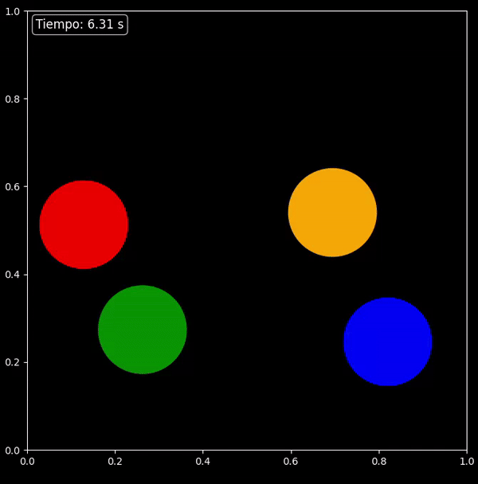

# Simulación de colisiones elásticas entre 4 discos de mismo radio, en un espacio cerrado.

Este script configura y ejecuta una simulación de colisiones elásticas utilizando los objetos `Disco` y `Escenario` definidos en el módulo `classes`. Se generan aleatoriamente posiciones iniciales para un conjunto de cuatro discos y se les asignan colores variados. La simulación se ejecuta y se visualiza en tiempo real.
Primero va a ser necesario importar las herramientas necesarias:

-`numpy`

-`classes` (debe incluir las clases `Disco` y `Escenario`).

De esta manera, primero es necesario:
```py
import numpy as np
from classes import Disco, Escenario
```
Seguidamente, definimos el tamaño del espacio de simulación y los parámetros iniciales, siendo estos 4 discos de radio de 0.1:

```py
espacioHorizontal = 1.0  
espacioVertical = 1.0    
cantidadDiscos = 4       
radioDiscos = 0.10  
```
Después se definen las posiciones aleatoriamente para los discos, asegurando a la vez que los discos no estén superpuestos

```py
posiciones = []
while len(posiciones) < cantidadDiscos:
    nueva_pos = np.random.uniform(radioDiscos, espacioHorizontal - radioDiscos, 2)
    if all(np.linalg.norm(nueva_pos - p) > 2 * radioDiscos for p in posiciones):
        posiciones.append(nueva_pos)
```
Podemos perzonalizar los discos asignándoles colores de manera cíclica, en nuestro caso decidimos utilizar los colores: azul, rojo, verde y naranja:
```py
colores = ['blue', 'red', 'green', 'orange']
discos = [
    Disco(pos[0], pos[1], colores[i % len(colores)], radioDiscos)
    for i, pos in enumerate(posiciones)
]
```
Finalmente, configuramos el espacio de simulación y ejecutamos la simulación:
```py
simulacion = Escenario(discos, 0.01)
simulacion.runSimulation(
```
### A continuación se mostrará la simulación resultante para 4 discos de radio=0.1 unidades:


