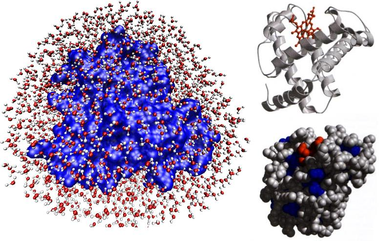

# Dinámica Molecular en dos Dimensiones: Discos Sólidos.

La dinámica molecular es un tipo de simulación molecular computacional, con el objetivo de analizar el comportamiento de un sistema ya sea físico, químico o biológico; a través del tiempo, calculando las fuerzas entre los átomos que lo conforman mediante ecuaciones de movimiento, con específicaciones de condiciones iniciales y de frontera. 

La dinámica molecular es de gran importancia en el mundo de las ciencias, ya que nos permiten estudiar aquellas moléculas que no se pueden observar por medio de microscopía electrónica o que presentan tiempos de equilibrios en escalas tan pequeñas como de orden de nanosegundos, que no se pueden medir en laboratorio o que simplemente su dinámica puede ser más clara por medio de métodos númericos y herramientas computacionales. 

Hoy en día la dinámica molecular es utilizada en diversas areas de la ciencia para el análisis de muchos distintos sitemas fisicoquimicos de interés, entre ellos, se pueden mencionar estudios para cambios de fase, solubilidad de moléculas, viscosidad de líquidos, describir el comportamiento de una proteína o móleculas complejas, permite medir la fuerza de interacción entre posibles fármacos y sus dianas biomolecularesentre muchas otras. Si bien las ecuaciones del movimiento no describen el sistema a nivel cuántico, este tipo de estudios han mostrado buena correlación con resultados experimentales, y se pueden realizar con equipos de cómputo convencionales pero que cumplan ciertas específicaciones técnicas. 

El objetivo de este proyecto es realizar una simulación de dos dimensiones con 4 discos sólidos, que se muevan sin fricción ni momento angular dentro de una caja de longitud unitaria, a estos discos se les puede asociar una energía cinética inicial aleatoria, resultando en una distribución de velocidades aleatorias para el sistema.

