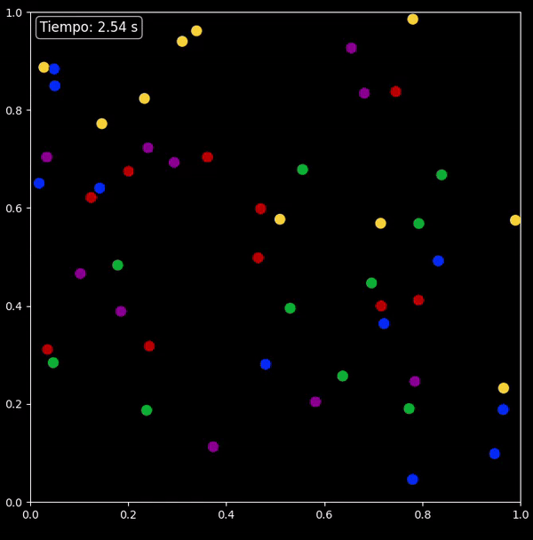

# Simulación de colisiones elásticas entre múltiples discos en un espacio cerrado.

Este script configura y ejecuta una simulación de colisiones elásticas utilizando
los objetos `Disco` y `Escenario` definidos en el módulo `classes`. Se generan 
aleatoriamente posiciones iniciales para un conjunto de discos y se les asignan
colores variados y radios específicos. La simulación se ejecuta y se visualiza en tiempo real.

Dependencias:

-`numpy`

-`classes` (debe incluir las clases `Disco` y `Escenario`).

Para realizar esta simulación iniciamos llamando las bibliotecas a utilizar, en este caso como ya mencionamos anteriormente, necesitamos `numpy`, `Disco` y `Escenario`:
```py
import numpy as np
from classes import Disco, Escenario
```
Seguidamente, empezamos con el código como tal, definiendo el espacio de simulación y los parámetros iniciales, en nuestro caso, ahora usamos 50 discos.
```py
espacioHorizontal = 1.0  
espacioVertical = 1.0    
cantidadDiscos = 50      
```
También se define el tamaño de la cuadrícula para posicionar los discos, de tal manera que si el cuadrado del largo de matriz sea menos que la cantidad de discos, se procede a sumarle una unidad al largo de matriz.
```py
largoMatriz = 1
while True:
    if largoMatriz * largoMatriz < cantidadDiscos:
        largoMatriz += 1
    else:
        break
```
Luego se definen las distancias verticales y horizontalesde separación entre los discos, de la siguiente manera:
```py
distanciaHorizontal = espacioHorizontal / (largoMatriz + 1)
distanciaVertical = espacioVertical / (largoMatriz + 1)
```
Seguidamente se inicializa la matriz de posiciones y se asigna la posición inicial:
```py
posiciones = np.zeros([largoMatriz * largoMatriz, 2])
posiciones[0] = [distanciaHorizontal, distanciaVertical]
```
Luego se procede a calcular las posiciones iniciales distribuidas uniformemente en la cuadrícula:
```py
for i in range(1, largoMatriz * largoMatriz):
    if round(posiciones[i - 1][0] + distanciaHorizontal, 2) >= espacioHorizontal:
        posiciones[i][0] = distanciaHorizontal
        posiciones[i][1] = distanciaVertical + posiciones[i - 1][1]
    else:
        posiciones[i][0] = distanciaHorizontal + posiciones[i - 1][0]
        posiciones[i][1] = posiciones[i - 1][1]
```
Después se seleccionan de manera aleatoria las posiciones iniciales de los discos:
```py
indicesAleatorios = np.random.choice(largoMatriz * largoMatriz, cantidadDiscos, replace=False)
posiciones = posiciones[indicesAleatorios]
```
Una vez teniendo todo lo anterior listo, se procede a crear los objetos `Disco` con radios de personalizados, además se definen los colores de forma secuencial:
```py
discos = [0] * cantidadDiscos
for i in range(cantidadDiscos):

    # Define los colores de los discos en un orden secuencial
    if i % 5 == 0:
        color = '#0033ff' # Color azul
    elif i % 5 == 1:
        color = '#cc0000' # Color rojo
    elif i % 5 == 2:
        color = '#009933' # Color verde
    elif i % 5 == 3:
        color = '#ffcc33' # Color amarillo
    else:
        color = '#990099' # Color morado

    radio = 0.05
    discos[i] = Disco(posiciones[i][0], posiciones[i][1], color, radio)
```
Finalmente Se configura el escenario de simulación, con un paso de tiempo de 0.01 unidades; y se ejecuta la simulación:
```py
simulacion = Escenario(discos, 0.01,espacioHorizontal,espacioVertical,timerVisible=True)
simulacion.runSimulation()
```
A continuación, se mostrarán dos simulaciones de este código, una con discos de radio de 0.05 unidades y la otra con discos con radio de 0.01 unidades.

### 50 discos de radio = 0.05 unidades:


### 50 discos de radio= 0.01 unidades:


