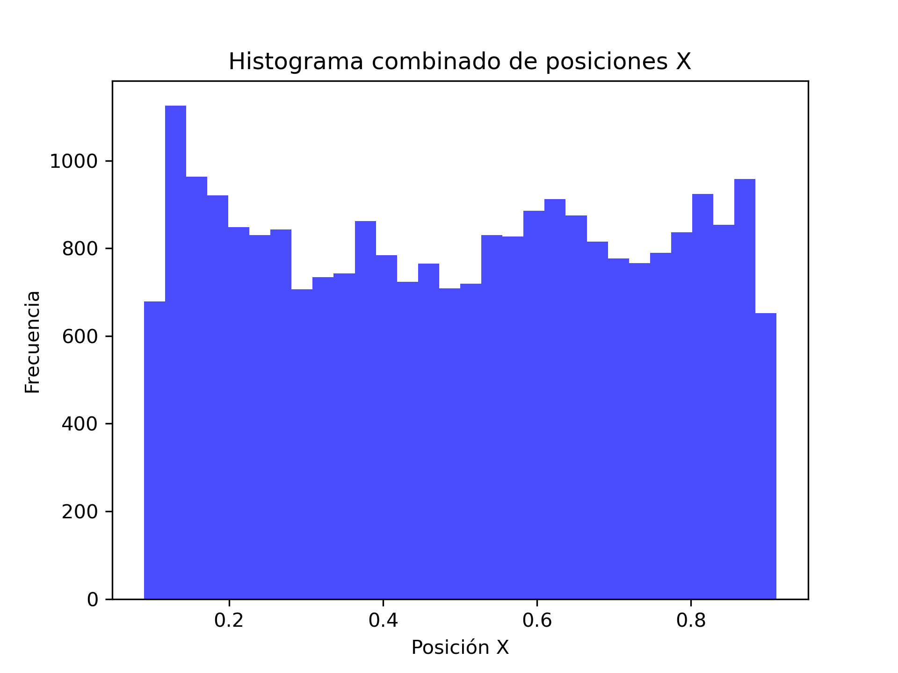
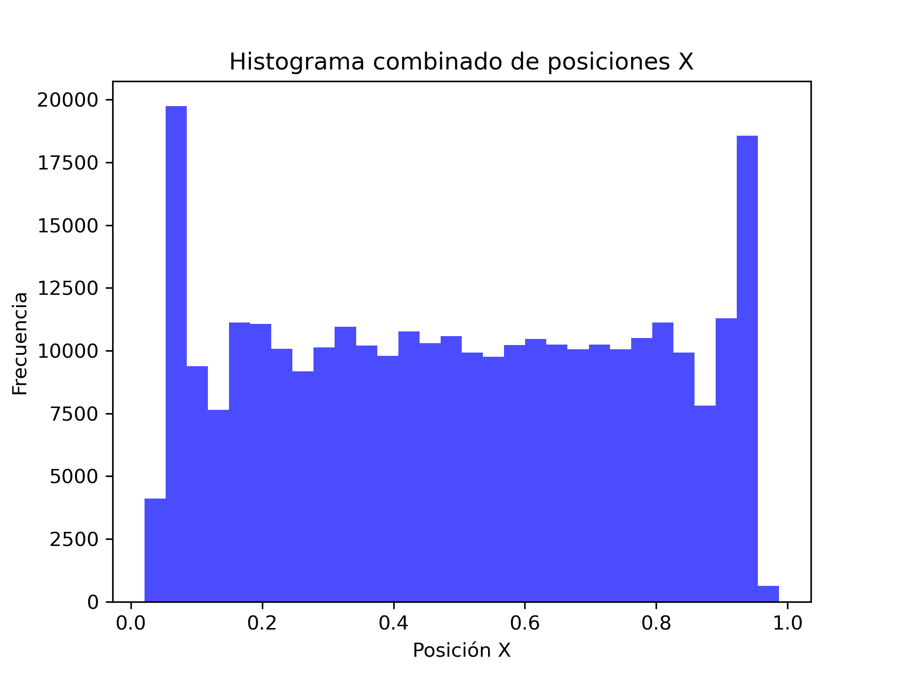
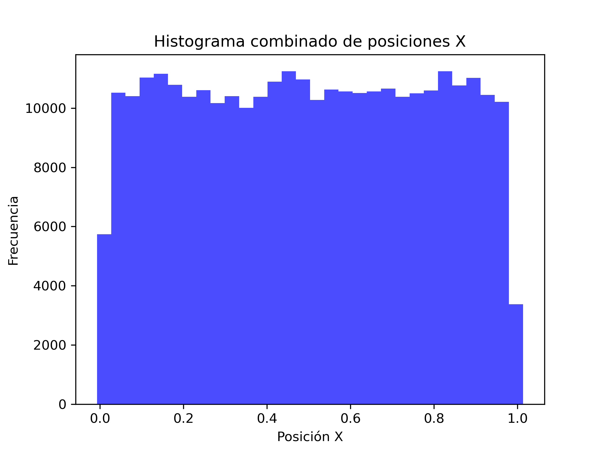

Se realizaron varios histogramas de las posiciones de los centros de los discos a lo largo del eje x, esto para permitirnos analizar las posiciones más recurrentes de los discos y poder estudiar su comportamiento.

EMpezando con la simulación de únicamente 4 discos, tenemos el siguiente histograma:

Del cual podemos observar que la posición más frecuente es en aproximadamente 0.9 unidades en el eje x, seguido de esta tambíen se frecuentaban mucho en la posición 0.2, 0.5 y 0.6. Además la posición menos frecuente fue en 0.1 y en 0.95, aproximadamente.

A continuación, se presenta el histograma para varios discos con radio de 0.01 unidades:

De estos discos, podemos observas que casi todas las posiciones tienen la misma frecuencia, únicamente los extremos son las posiciones donde la frecuencia disminuye considerablemente.

Por útimo tenemos el Histograma de varios discos con radio de 0.5 unidades:

De este histograma se puede observar, prácticamente lo contrario al caso de radios pequeños, ya que en este caso, los extremos son los que presentan mayor frecuencias, es decir las posiciones cercanas a 0.0 y a 1.0. Por otro lado, las posiciones centradas tienen el una fracuencias similar pero bastante más baja que en los extremos.

Con estos histogramas podemos concluir que entre más grandes sean los discos, tendrán mayor posibilidad de encontrarse en los extremos del contenedor y por al contrario, entre más pequeños sean los discos, serán más probables de encontrar en la parte interna del contenedor, además la cantidad de discos también nos transfiere información importante, ya que entre menos discos hayan, será más díficil poder predecir sus posiciones.

